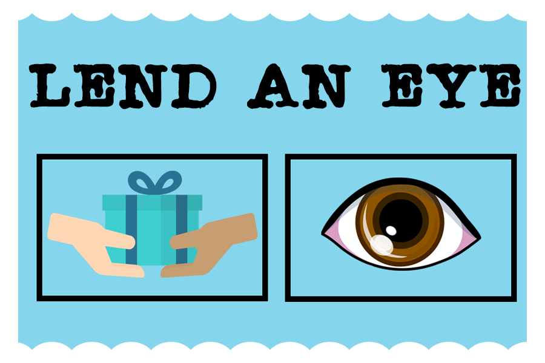
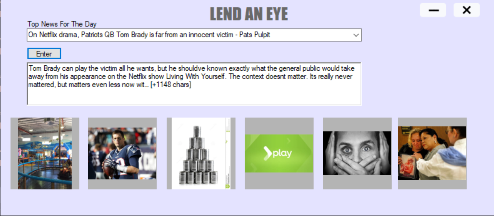
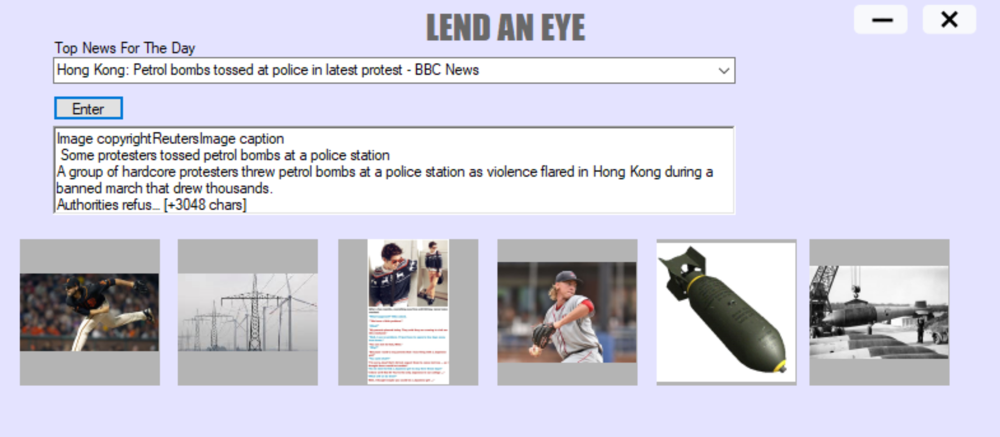

DEVELOPERS: Julian Berrio, Peyton Marinelli, Ahsan Rohan, BB 
EVENT: Hack FSU 2019 
DATE STARTED: 10/18/2019 
DATE SUBMITTED: 10/20/2019

AWARDS:Best use of Google Cloud at Hack FSU 2019

INTRODUCTION
In modern day, its become increasingly difficult for some members of society to keep up with the ever-increasing density of news and information. This desktop application was designed to help inform individuals who find it difficult to read news articles like the elderly or people who dont speak the written language.

INSPIRATION
It all started with a light storm of spaghetti code. What was originally a fun time playing Minecraft and Don't Starve Together to hopefully start off the weekend well turned into frantic grasping for ways to get our fact checker to work with less than 12 hours left. We had been able to use the Google Natural Language API to have the parts of speech recognized and knew we couldn't let that hard work go to waste. At 3 AM, with all members running solely on $30 worth of energy drinks and desperation, crazed inspiration struck to help make reading online easier for those who needed it, particularly the elderly or those who are bilingual. It was decided to focus on the news, especially with the rapid shift of reliance from paper newspapers to online resources for the elderly. Our program will list the recent news headlines and once selected, the first sentence appears along with relevant pictures in order to allow for visual stimulation as well for readers and make reading the news easier for them.

TECHNOLOGIES USED
C#, Google Cloud Services, Google Language API, Microsoft Azure, and Bing API

